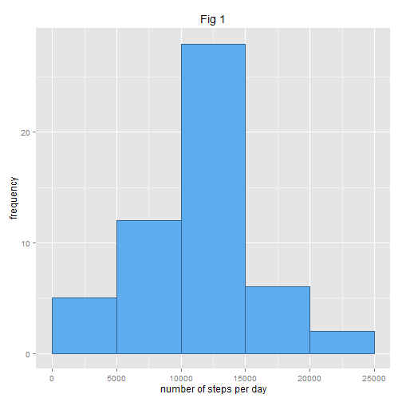
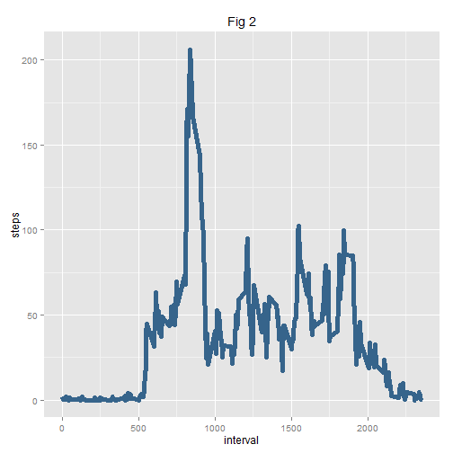
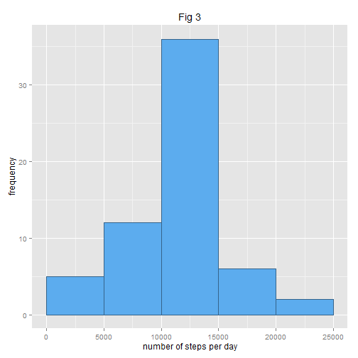
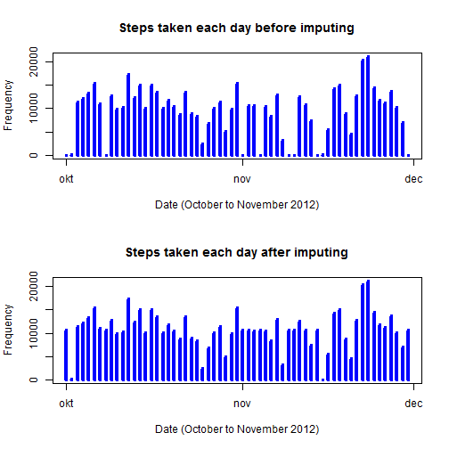
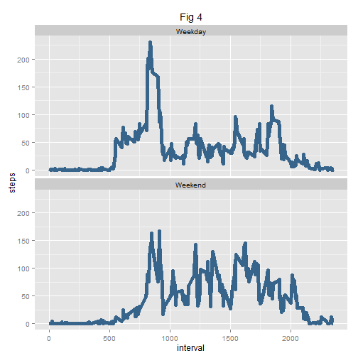

Date: 05/12/2015
Author: Chakra C

# 1.1 Loading and processing input data
The data for this assignment can be downloaded from the course web site:  
- Dataset: [Activity monitoring data](https://d396qusza40orc.cloudfront.net/repdata%2Fdata%2Factivity.zip)  

The variables included in this dataset are:  
- steps: Number of steps taking in a 5-minute interval (missing values are coded as NA)  
- date: The date on which the measurement was taken in YYYY-MM-DD format  
- interval: Identifier for the 5-minute interval in which measurement was taken  

The dataset is stored in a comma-separated-value (CSV) file and there are a total of 17,568 observations in this dataset.  61 days, 24 * 12 = 288 samples / day => 61 * 288 = 17.568 data points.


```r
# The following libraries need to be installed on this system to enable running this knitr script
library(ggplot2)
library(dplyr)

# The dataset used has to exist on the same directory as where this R script is stored

setwd('C:/Coursera/Data_Science/Reproducible_Research/ReproducibleResearch/data/')

df <- read.csv("activity.csv")
```
# 1.2 Process input data  

```r
names(df)
```

```
## [1] "steps"    "date"     "interval"
```

```r
head(df)
```

```
##   steps       date interval
## 1    NA 2012-10-01        0
## 2    NA 2012-10-01        5
## 3    NA 2012-10-01       10
## 4    NA 2012-10-01       15
## 5    NA 2012-10-01       20
## 6    NA 2012-10-01       25
```

```r
summary(df)
```

```
##      steps                date          interval     
##  Min.   :  0.00   2012-10-01:  288   Min.   :   0.0  
##  1st Qu.:  0.00   2012-10-02:  288   1st Qu.: 588.8  
##  Median :  0.00   2012-10-03:  288   Median :1177.5  
##  Mean   : 37.38   2012-10-04:  288   Mean   :1177.5  
##  3rd Qu.: 12.00   2012-10-05:  288   3rd Qu.:1766.2  
##  Max.   :806.00   2012-10-06:  288   Max.   :2355.0  
##  NA's   :2304     (Other)   :15840
```
  
No of transformations necessary.  
Reasoning for transformations: only 5 minute data (non-NA's) needed: could create a subset for that excluding date info.

# 2. Mean total number of steps taken per day


# 2.1 Total number of steps taken per day  

```r
df.steps <- tapply(df$steps, df$date, Fun=sum, na.rm=True)

## Computes a summary of the total number of steps taken each day
by_day <- aggregate(steps ~ date, data = df, sum)

summary(by_day)
```

```
##          date        steps      
##  2012-10-02: 1   Min.   :   41  
##  2012-10-03: 1   1st Qu.: 8841  
##  2012-10-04: 1   Median :10765  
##  2012-10-05: 1   Mean   :10766  
##  2012-10-06: 1   3rd Qu.:13294  
##  2012-10-07: 1   Max.   :21194  
##  (Other)   :47
```
# 2.2 Histogram of total number of steps taken per day  

Histogram showing total number of steps each day:  

```r
# 2.2 Histogram of total number of steps taken per day. Plot using ggplot2
ggplot(by_day, aes(steps)) + geom_histogram(fill = "steelblue2", colour = "steelblue4", 
    breaks = c(0, 5000, 10000, 15000, 20000, 25000)) + labs(y = expression("frequency")) + 
    labs(x = expression("number of steps per day")) + labs(title = expression("Fig 1"))
```

 

# 2.3 Mean and median of total number of steps taken per day  
Mean:   

```r
# 2.3 Mean and median of the total number of steps taken per day
mean1<-mean(by_day$steps)
mean1
```

```
## [1] 10766.19
```
Median:  


```r
## Median 
median1<-median(by_day$steps)
median1
```

```
## [1] 10765
```
# 3.1 Average daily activity pattern
Make a time series plot (i.e. type = "l") of the 5-minute interval (x-axis) and the average number of steps taken, averaged across all days (y-axis)
# 3.1 Time-series plot of 5 minute intervals vs steps taken

```r
# 3. Average daily activity pattern
# 3.1 time-series plot of 5 minute intervals vs steps taken
## Computes a summary of the average by 5minute interval across all days
by_interval <- aggregate(steps ~ interval, data = df, FUN = function(x) {
    mean(x, na.rm = TRUE)
})

## Time series plot
ggplot(by_interval, aes(interval, steps)) + geom_line(colour = "steelblue4", 
    lwd = 2) + labs(title = expression("Fig 2"))
```

 

# 3.2 5 minute max value of daily activity pattern
Which 5-minute interval, on average across all the days in the dataset, contains the maximum number of steps?


```r
# 3.2 time interval of maxiumum number of steps
## Maximum interval
by_interval$interval[which.max(by_interval$steps)]
```

```
## [1] 835
```

```r
## Maximum value
max(by_interval$steps)
```

```
## [1] 206.1698
```

# 4. Imputing missing values
Note that there are a number of days/intervals where there are missing values (coded as NA). The presence of missing days may introduce bias into some calculations or summaries of the data.

# 4.1 Total number of missing values


```r
# 4. Imputing missing values
na<-sum(is.na(df))
rate<-paste(round(100*(na/nrow(df)), 3), "%")
# 4.1 Number of missing values in original dataset:
rate
```

```
## [1] "13.115 %"
```


# 4.2 Replace missing values by mean of 5 minute intervals
We can replace the missing values with the mean value of the 5-minute intervals by using a function that is conditional on the is.na and number of steps. 


```r
# 4.2 Use average number of non-NA steps per 5 minute interval over all days in dataset
# save original dataset first
dates <- strptime(df$date, "%Y-%m-%d")
uniqueDates <- unique(dates)
stepsSplit <- split(df$steps, dates$yday)
totalStepsPerDay <- sapply(stepsSplit, sum, na.rm=TRUE)
head(totalStepsPerDay)
```

```
##   274   275   276   277   278   279 
##     0   126 11352 12116 13294 15420
```

```r
for (i in 1:length(df$steps)) {
    if (is.na(df[i, 1])) {
        
        ## Corresponding 5-minute interval, computed before as by_interval
        steps_average <- subset(by_interval, by_interval$interval == as.numeric(df[i,3]))$steps
        
        ## Replaces the value
        df[i, 1] <- steps_average
    } else {
        df[i, 1] <- df[i, 1]
    }
    df
}
```

# 4.3 Create a new dataset including adapted missing data
Update dataset:

```r
# 4.3 Dataset df updated with average values per 5 minute interval in case original was NA
head(df)
```

```
##       steps       date interval
## 1 1.7169811 2012-10-01        0
## 2 0.3396226 2012-10-01        5
## 3 0.1320755 2012-10-01       10
## 4 0.1509434 2012-10-01       15
## 5 0.0754717 2012-10-01       20
## 6 2.0943396 2012-10-01       25
```

```r
tail(df)
```

```
##           steps       date interval
## 17563 2.6037736 2012-11-30     2330
## 17564 4.6981132 2012-11-30     2335
## 17565 3.3018868 2012-11-30     2340
## 17566 0.6415094 2012-11-30     2345
## 17567 0.2264151 2012-11-30     2350
## 17568 1.0754717 2012-11-30     2355
```
# 4.4 Histogram of new dataset including adapted missing data
Show the histogram of the new dataset:  

```r
# 4.4 Histogram, mean and median of updated dataset
by_date <- aggregate(steps ~ date, data = df, sum)

ggplot(by_date, aes(steps)) + geom_histogram(fill = "steelblue2", colour = "steelblue4", 
    breaks = c(0, 5000, 10000, 15000, 20000, 25000)) + labs(y = expression("frequency")) + 
    labs(x = expression("number of steps per day")) + labs(title = expression("Fig 3"))
```

 

The distribution in Fig 3 visually looks identical to the original in Fig 1.  
Add two daily steps graphs to see the differences due to NA resolving:   

```r
# Make plot where the x-axis denotes the day
# and the y-axis denotes the total number of steps taken  for each day
par(mfcol=c(2,1))

# by_date0 <- aggregate(steps ~ date, data = df0, sum)
plot(uniqueDates, totalStepsPerDay, main="Steps taken each day before imputing", 
     xlab="Date (October to November 2012)", ylab="Frequency", type="h", lwd=4, col="blue")

plot(uniqueDates, by_date$steps, main="Steps taken each day after imputing",
     xlab="Date (October to November 2012)", ylab="Frequency", type="h", lwd=4, col="blue")
```

 

It can be clearly seen that there is an effect on the first and last day (both entirely NA days).  

Mean and median of this dataset are:  

```r
mean2<-mean(by_date$steps)
mean2
```

```
## [1] 10766.19
```

```r
median2<-median(by_date$steps)
median2
```

```
## [1] 10766.19
```

```r
# Analyze possible differences with original dataset
## Variation of the mean due to the missing value imputing strategy in percent
delta_mean<-(mean1-mean2)/mean1
paste(round(100*delta_mean, 4), "%")
```

```
## [1] "0 %"
```

```r
## Variation of the mean due to the missing value imputing strategy in percent
delta_median<-(median1-median2)/median1
paste(round(100*delta_median, 4), "%")
```

```
## [1] "-0.011 %"
```

```r
# The mean is the same, the median has shifted a bit, though.
```
The mean is the same, the median has shifted a bit, though.  

# 5. Differences in activity patterns between weekdays and weekends
Using the filled-in dataset the differences between weekdays and weekends are determined.  
# 5.1 Weekdays and weekends  
Problems:  
1. date names are language dependent  
2. date recognition also Windows dependant  
Solution: use day numbers, i.e. Sunday = 0, Saturday = 6  

```r
# 5. Activity patterns per weekday or weekend

# Disadvantage of orignal solution using day names like 'Saturday' is 
# that the name of the day is Windows Language Settings dependant.
# So preferrably use day numbers: 0 = Sunday, 6 = Saturday

# http://stackoverflow.com/questions/9216138/find-the-day-of-a-week-in-r
# The wday component of a POSIXlt object is the numeric weekday (0-6 starting on Sunday).
# library(dplyr) needed
df <- mutate(df, day = as.POSIXlt(df$date)$wday)

# Add column 5 = Weekday or Weekend
# 1-10-2012 = Monday = 1 OK; 30-11-2012 = Friday = 5 OK:
for (i in 1:length(df$day)) {
  if (df[i, 4] == 6 || df[i, 4] == 0) {
    df[i, 5] <- "Weekend"
    
  } else {
    df[i, 5] <- "Weekday"
    
  }
}
colnames(df)[5] <- "Weekdays"
names(df)
```

```
## [1] "steps"    "date"     "interval" "day"      "Weekdays"
```

```r
df$Weekdays <- as.factor(df$Weekdays)
head(df,10)
```

```
##        steps       date interval day Weekdays
## 1  1.7169811 2012-10-01        0   1  Weekday
## 2  0.3396226 2012-10-01        5   1  Weekday
## 3  0.1320755 2012-10-01       10   1  Weekday
## 4  0.1509434 2012-10-01       15   1  Weekday
## 5  0.0754717 2012-10-01       20   1  Weekday
## 6  2.0943396 2012-10-01       25   1  Weekday
## 7  0.5283019 2012-10-01       30   1  Weekday
## 8  0.8679245 2012-10-01       35   1  Weekday
## 9  0.0000000 2012-10-01       40   1  Weekday
## 10 1.4716981 2012-10-01       45   1  Weekday
```

```r
tail(df,10)
```

```
##           steps       date interval day Weekdays
## 17559 0.0000000 2012-11-30     2310   5  Weekday
## 17560 0.8301887 2012-11-30     2315   5  Weekday
## 17561 0.9622642 2012-11-30     2320   5  Weekday
## 17562 1.5849057 2012-11-30     2325   5  Weekday
## 17563 2.6037736 2012-11-30     2330   5  Weekday
## 17564 4.6981132 2012-11-30     2335   5  Weekday
## 17565 3.3018868 2012-11-30     2340   5  Weekday
## 17566 0.6415094 2012-11-30     2345   5  Weekday
## 17567 0.2264151 2012-11-30     2350   5  Weekday
## 17568 1.0754717 2012-11-30     2355   5  Weekday
```

# 5.2 Panel plot 
A panel plot is created containing a time series plot (i.e. type = "l") of the 5-minute interval (x-axis) and the average number of steps taken, averaged across all weekday days or weekend days (y-axis). 

```r
summary <- aggregate(df$steps, list(interval = df$interval, day = df$Weekdays), mean)
names(summary) <- c("interval", "Weekdays", "steps")

## Plot using ggplot2
ggplot(summary, aes(interval, steps)) + geom_line(color = "steelblue4", lwd = 2) + 
  facet_wrap(~Weekdays, ncol = 1) + labs(title = expression("Fig 4"))
```

 

From the graph we see that weekday steps start out similar to the weekend steps. The early morning weekday peak activity is lower than during a weekend. The overall weekend activity during the day is higher than during the week.
